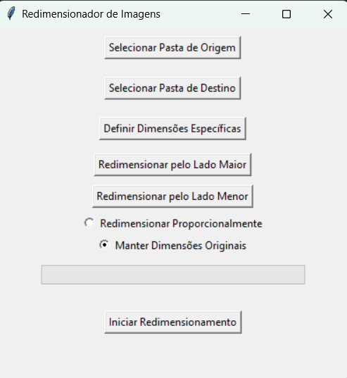

# Image Resizer

Este é um aplicativo de redimensionamento de imagens desenvolvido em Python, utilizando a biblioteca PIL (Pillow) para manipulação de imagens e Tkinter para interface gráfica. O aplicativo permite ao usuário escolher imagens de uma pasta, definir novas dimensões (largura e/ou altura), e salvar as imagens redimensionadas em outra pasta.

## Características

- Redimensionar imagens mantendo a proporção ou alterando livremente as dimensões.
- Interface gráfica simples e fácil de usar.
- Suporte para os formatos de imagem mais comuns, como JPG, PNG e JPEG.
- Opção para selecionar uma pasta de origem e destino para as imagens.

## Requisitos

Para executar este aplicativo, você precisa ter Python instalado em sua máquina, além das bibliotecas Pillow e Tkinter. Python pode ser baixado [aqui](https://www.python.org/downloads/), e as bibliotecas podem ser instaladas via pip:

```bash
pip install Pillow
````
````bash
pip install tk
`````
## Como instalar

````bash
python Redimensionar.py
````
## Como Usar

Aqui está uma prévia da interface do aplicativo:



1. Clone o repositório ou baixe o arquivo EXE do aplicativo.
2. Se estiver executando a partir do código-fonte, navegue até o diretório do arquivo `Redimensionar.py` e execute o seguinte comando no terminal:
